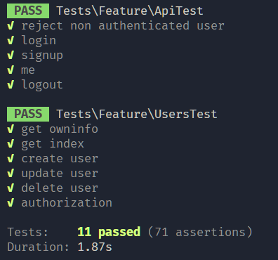

# User management

This is a simple user management system. It is built using Laravel and Vue.js (with vuetify). And JWT is used for authentication.

## Installation

### Prerequisites

-   node.js
-   npm
-   php
-   composer

### Steps

1. Clone the repository
1. Open a terminal
1. Move the .env.example file to .env using the command `mv .env.example .env`
1. We use sqlite as the database, so no need to configure the database
1. Run `composer install`
1. Run `php artisan key:generate`
1. Run `php artisan migrate --seed`
1. Run `php artisan serve`
1. Open a new terminal
1. Run `npm install`
1. Run `npm run dev`
1. Open your browser and go to `http://localhost:8000`

## Testing

The testing is done using phpunit. And these files are located in the `tests/Feature` directory.

To run the tests, run the command `php artisan test`

Testing were written to test the API endpoints and authentication.

Authentication tests are located in the `tests/Feature/ApiTest.php` file.

User management tests are located in the `tests/Feature/UsersTest.php` file.

## API Endpoints

The user management system has the following API endpoints:

-   GET /api/users
-   POST /api/users
-   GET /api/users/{id}
-   PUT /api/users/{id}
-   DELETE /api/users/{id}

The authentication system has the following API endpoints:

-   POST /api/auth/login
-   POST /api/auth/logout
-   POST /api/auth/signup

All the API endpoints are protected by middleware. So, you need to pass the bearer token in the header to access the endpoints.

## System architecture

The system is built using the MVC architecture pattern using Laravel for the backend. Laravel as a Framework provides a lot of features out of the box that makes it easy to build a RESTful API, specially with the Eloquent ORM, migrations, middleware, routing, etc.

For the frontend, Vue.js is used along with vuetify for the UI components. Vuetify allows us to build a responsive and beautiful UI with ease.

### Views

The total views created are:

1. Home - _This is the landing page, where the user can see the login and signup buttons_
1. Login - _Login form_
1. Signup - _Signup form_
1. Dashboard - _This is the main page where the user can see the list of users and perform CRUD operations_
1. User show - _This is the page where the user can see the details of a user_

### Models

There is only one model in the system, which is the User model.

### Controllers

Two controllers are created, UserController for the user management and AuthController for authentication.

### Middleware

ApiAuthMiddleware is created to protect the API endpoints. This middleware checks if the user is authenticated or not. If the user is not authenticated, it returns a 401 status code.

The system uses JWT for authentication. The token is stored in the local storage of the browser which is not the best practice. But for the sake of simplicity, it is used in this system.

## Test Driven Development

Test Driven Development (TDD) was implemented during the development of the application. First the API endpoints were defined in api.php, then the methods were implemented in the controller, the tests were written for the endpoints. If some any test failed, the code was modified to make the test pass. This cycle was repeated until all the tests passed and the system was working as expected.

TDD allowed me to write clean and maintainable code. It also helped to identify bugs early in the development process without the need to manually test the application using tools like Postman.

